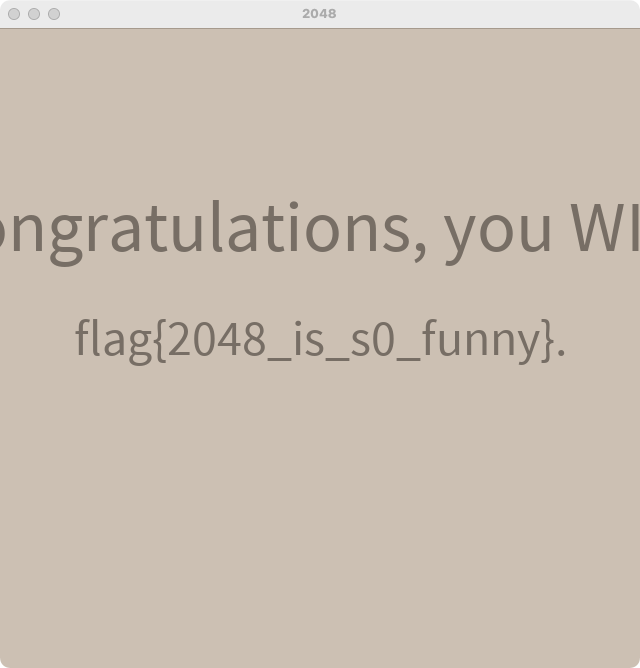
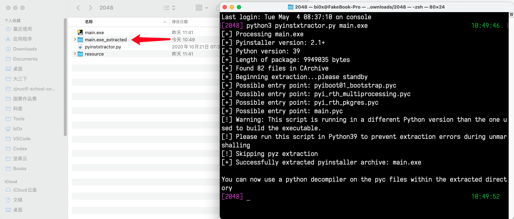
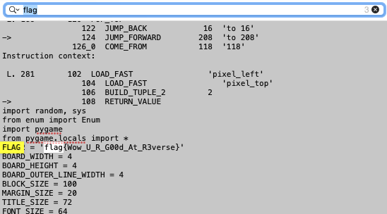
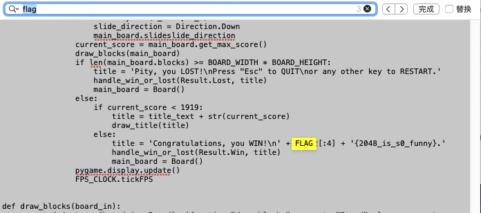

# flag1

- 可以把最大的数字玩到 2048，那就超过了 1919 分，会得到第一阶段的 flag



> flag{2048_is_s0_funny}

- 当然不玩也是可以的，直接进入 flag2 阶段

# flag2

- 首先我们可以通过程序 icon 或者运行时候的信息判断出这个程序是 Python 写的
- 那么 Python 打包成 exe 有办法解包吗，必然是有办法的
- 通过百度类似`Python exe反编译` 相关的内容，可以发现有个辅助工具 `pyinstxtractor.py` 可以使用
- 下载到文件后直接使用 `python pyinstxtractor.py main.exe` 即可实现解包



- 成功后会在终端工作目录下发现有一个解包的文件，打开就看到一个大大的 main.pyc
- 对于正常生成没有修改过的 pyc 文件，通过百度我们可以发现使用 uncompyle6 工具可以辅助反编译
- 由于 uncompyle6 版本的问题，没有办法反编译出完整的代码，但是不影响，我们将结果保存到文件

```shell
uncompyle6 main.pyc >> res.txt  
```

- 打开文件后 `Ctrl + F` 搜索 flag，可以直接发现 flag2
- 对于 flag1，实际上是用 flag2 拼接的，往下搜索一下也就能发现了





