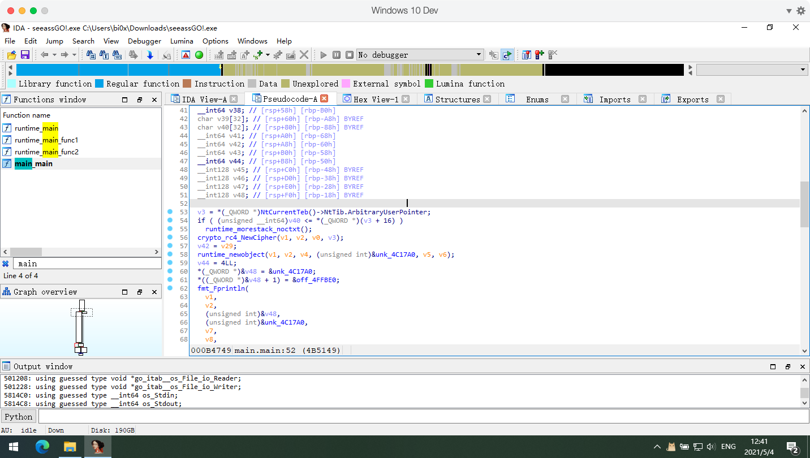

> 最近的 re 趋势都在向 Golang 转变，像字节 CTF 就是 golang 全家桶，凡是比赛几乎都有 golang
>
> Go 的编译机制和 C 有很大的不同，导致逆向起来非常困难，也正因此出了这样一道题目
>
> 对于对 Go 不熟悉的人，如果搜索引擎用得不好的话，完全是没办法下手的

- 拿到文件发现输入什么都会闪退，这个要拿终端运行，百度一下就会有结果


- 运行成功后发现只是个简单的 flag 检查工具
- 顺手拖进 IDA 查看，由于是 Go 统一是静态编译的，故 IDA 分析过程较慢
- 待分析完成后，在函数列表搜索 `main` 顺利找到主函数



- 上来就看到 `crypto_rc4_newcipher` 函数，即使是没接触过 go 的同学，也能很顺利的通过搜索引擎发现这个是 rc4 加密的初始化函数
- 同样，下面的 `fmt_Fprintln` 也可以查到是终端输出函数，`fmt_Fscanln` 同理
- 我们对于函数传入的参数不需要那么敏感，有些参数没必要去了解他是用来做什么的
    - **关键是整个函数做了什么事情**
- 通过交叉调用以及变量的赋值关系，可以发现第一个输出函数输出的就是 `Please input flag:`


- 往下继续分析，发现读取完用户输入后有一个 rc4 的处理过程
- 既然题目提示是 Golang，而且在 IDA 的相关分析中也可以查到 Golang 相关的信息
- 那么就根据这个内容进一步搜索 golang 的 rc4 加密方法，可以看到很多和逆向出来的内容类似的函数
- 同样，那个 `encoding_hex_Encode` 函数是将字符串内容转换成十六进制值的，这个也可以搜索到
- 又发现最后主函数有一个判断，根据判断内容有两个输出，其实就很容易的分析出来这个是 flag 的比较函数
- 那么整体的过程就很明显的，读取用户输入，rc4 加密，比较加密结果
- 比较的是结果，那就没有办法通过动态调试发现明文 flag，只能逆向分析 rc4
- 不过在 if 中我们可以发现密文内容，也就是被比较的静态字符串


- 我们可以进去把整个十六进制字符串提取出来，结果如下

```c
e328385c0a94d9f0379771744e4a4993743fbfa7a3869068b5d42483
```

- 对于 rc4，还有一个 Key 用于加密和解密，其实这个值在 main 函数的开头

- 由于 IDA 的反编译成伪代码功能并非完美，有些内容可能会丢失，这时候可以切到汇编页面看

- 像 rc4 初始化的时候必须有一个 Key 的，但是 IDA 的伪代码页面可能没有正常分析

    

- 这时候在汇编页面找必然是有的

    

- 注意，这里的 key 由于是数字存储的，因此是小端序，也就是说真正的 key 是反过来的 `BI0X`

- 看着 rc4 算法的详解手写一个解密，注意把十六进制的密文分割成一个个 char 来处理

    - 为了方便，这里直接手动分割了，就是每两位算一个 char

```python
import hashlib


def crypt(data, key):
    s = [0] * 256
    for i in range(256):
        s[i] = i
    print(s)
    j = 0
    for i in range(256):
        j = (j + s[i] + key[i % len(key)]) % 256
        print(j)
        s[i], s[j] = s[j], s[i]
    i = 0
    j = 0
    res = ""
    for c in data:
        i = (i + 1) % 256
        j = (j + s[i]) % 256
        s[i], s[j] = s[j], s[i]
        res = res + chr(c ^ s[(s[i] + s[j]) % 256])
    return res

key2 = "BI0X"
key = []
for i in key2:
    key.append(ord(i))
print(key)
data = [
  0xe3, 0x28, 0x38, 0x5c, 0x0a, 
  0x94, 0xd9, 0xf0, 0x37, 0x97, 
  0x71, 0x74, 0x4e, 0x4a, 0x49, 
  0x93, 0x74, 0x3f, 0xbf, 0xa7, 
  0xa3, 0x86, 0x90, 0x68, 0xb5, 
  0xd4, 0x24, 0x83
]
print(crypt(data, key))
```

