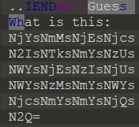
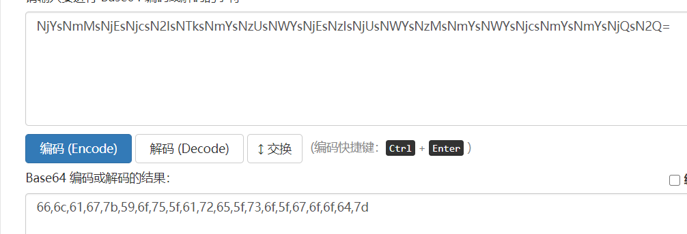

# 较为简单的flag1

压缩包解压后是一张图片 右键也看不到什么有用的信息

用010editor或者其他十六进制工具打开



最后有一段这个东西，看到结尾=号基本可以猜到是base64



解码后的东西是十六进制是东西，拿去转换一下

可以自己写python脚本也可以网上找在线工具

```python
data = [0x66,0x6c,0x61,0x67,0x7b,0x59,0x6f,0x75,0x5f,0x61,0x72,0x65,0x5f,0x73,0x6f,0x5f,0x67,0x6f,0x6f,0x64,0x7d]
flag = ""
for i in data:
		flag += chr(i)
print(flag)
```

得到flag

flag{You_are_so_good}

# 较为困难的flag2

这个是需要更改png文件的图片高度


在文件开头的第23-24个字节是文件的高度

我们修改为


得到flag

flag{Nice_job!}