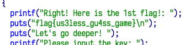

# flag1

- 获取的步骤可以硬猜，也可以直接用 IDA 打开
- 字符串里就有



# flag2

- 可以看到第二步密钥输入的时候有一个异或比对的过程
- 因此将其中的密文提取出来，根据异或的算法逆推过程即可得到 flag
    - 异或的逆运算也是异或

```c
#include <iostream>
using namespace std;
int main()
{
    int a[] = {
        103, 110, 98, 99, 126, 126, 55, 122, 86, 99, 120, 83, 121, 97, 96, 79, 116, 38, 96, 109, 104
    };
    for (int i = 0; i < 21; i++)
    {
        printf("%c", a[i] ^ (i + 1));
    }
}
```

